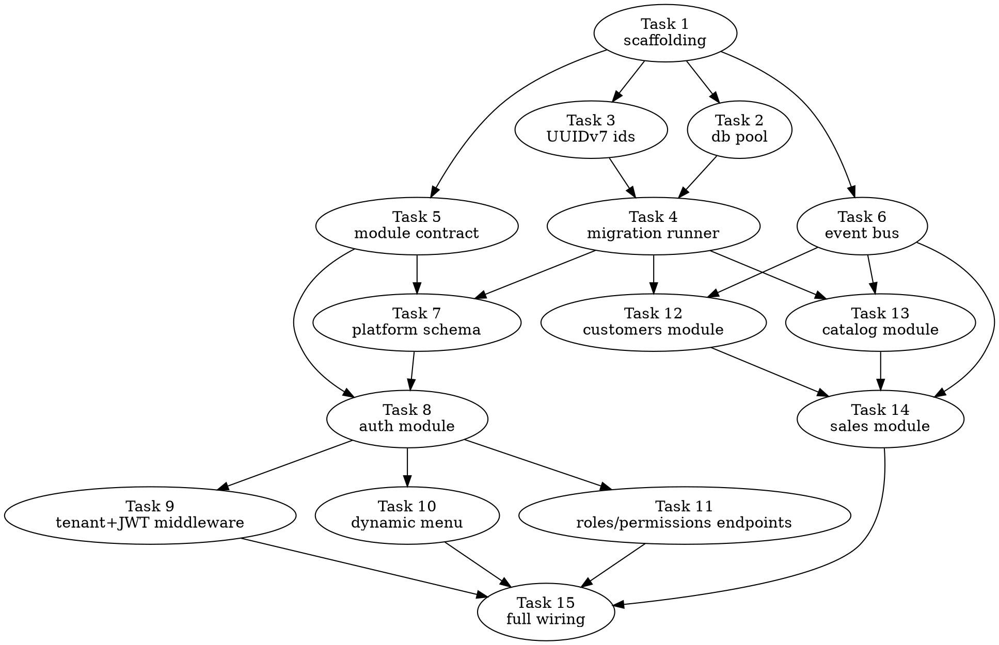

# parallel-plan-executor — Diseño

**Fecha:** 2026-07-04

## 1. Contexto

Un ejecutor secuencial de planes de implementación (formato `cys:plan`) corre tarea por
tarea, en un solo hilo: cada tarea corre su propio
ciclo TDD (test → rojo → implementar → verde → commit) y espera revisión humana antes de
pasar a la siguiente. Es correcto pero lento en tiempo de reloj cuando el plan tiene
muchas tareas independientes entre sí (ej. el plan de 15 tareas de `business-core`, donde
varios módulos de vertical no dependen unos de otros).

**Objetivo:** un Workflow (herramienta `Workflow` de Claude Code) reutilizable en
cualquier proyecto — sin importar el lenguaje/stack — que ejecute un plan ya escrito con
el mismo rigor TDD, pero corriendo en paralelo las tareas que no dependen entre sí. No
reemplaza a `subagent-driven-development` como concepto, reemplaza su **motor de
ejecución** cuando el plan lo amerita (varias tareas independientes).

**Fuera de alcance:**
- Escribir el spec o el plan (eso sigue siendo `brainstorming` + `writing-plans`).
- Llevar el resultado de working tree a PR — eso lo sigue haciendo el skill `git-flow`
  (`bacsystem/skills`), una sola vez al final, no por tarea.
- Carrera especulativa (reintentar una tarea lenta con un segundo agente en paralelo) —
  evaluada y descartada por ahora; ver sección 7.

## 2. Por qué es posible sin un agente clasificador

El template obligatorio de `writing-plans` exige que cada tarea declare:

```markdown
**Interfaces:**
- Consumes: [qué usa esta tarea de tareas anteriores — firmas exactas]
- Produces: [qué usan tareas posteriores — nombres y tipos exactos]
```

Como `Produces`/`Consumes` usan nombres/firmas exactos (no prosa libre), el grafo de
dependencias se puede inferir con **código determinista** (parseo de texto), sin
necesitar un agente que "lea y razone" el plan completo. Esto mantiene el costo de
orquestación bajo — el presupuesto de tokens se va en ejecutar tareas, no en planificarlas.

## 3. Arquitectura

```
plan.md ──► [1] Parser determinista (JS puro, sin agente)
                 extrae tareas + Files + Interfaces(Consumes/Produces)
                 construye el grafo de dependencias (DAG)
                    │
                    ▼
            [2] Ejecutor DAG fino
                 cada tarea arranca en cuanto SUS dependencias
                 (no toda una "capa") ya terminaron
                    │
                    ▼
      por cada tarea ──► [3] Worktree aislado
                            ciclo TDD: test→rojo→implementar→verde
                            commit (Conventional Commit, como ya hace
                            el template de writing-plans)
                            verify: detecta test/lint del proyecto
                            (misma heurística que
                            git-flow/references/verify-commands.md)
                            [4] Revisor adversarial (agente aparte)
                                 busca bugs / incumplimiento del plan
                    │
                    ▼
            [5] Merge serializado
                 al completar y pasar verificación, cada tarea entra
                 a una cola que mergea una por una hacia la rama de
                 integración (nunca antes que sus dependencias)
                    │
                    ▼
            [6] Reporte final
                 diff agregado + hallazgos de los revisores + qué
                 quedó bloqueado/se saltó → review humano UNA vez,
                 no por tarea. `git-flow` se invoca después, a mano,
                 cuando el usuario decide que está listo para PR.
```

## 4. Componentes

### 4.1 Parser del plan

- Separa el archivo por encabezados `### Task N: ...`.
- Por tarea extrae `Files` (Create/Modify/Test) e `Interfaces` (Consumes/Produces).
- Construye un índice `símbolo → tarea que lo produce` a partir de todos los `Produces`
  del plan.
- Para cada tarea, busca qué símbolos de su `Consumes` aparecen en ese índice → esas son
  sus dependencias "duras".
- Regla adicional: si dos tareas modifican el mismo archivo (`Modify`/`Create`
  coincidente), son dependientes en el orden en que aparecen en el plan, aunque
  `Interfaces` no lo diga explícitamente.
- Salida: grafo `{ taskId: [depTaskIds] }`. Si se detecta un ciclo, se detiene todo antes
  de ejecutar nada (plan malformado, ver sección 7).

### 4.2 Ejecutor DAG fino

- Por cada tarea: una promesa que espera `Promise.all(deps)` antes de arrancar su ciclo.
- Sin capas fijas — el propio `await` en JS resuelve el orden real, así que una tarea
  arranca en cuanto SUS dependencias específicas cierran, no cuando cierra todo un grupo
  nominal. Esto importa cuando las tareas de un mismo "grupo" tardan tiempos distintos.
- Se evaluó la alternativa de capas topológicas fijas (más simple de depurar) y se
  descartó por desperdiciar tiempo de reloj cuando una tarea de la capa tarda mucho más
  que sus compañeras.

### 4.3 Ciclo por tarea (worktree aislado)

- Cada tarea corre en su propio git worktree — evita que dos tareas paralelas que tocan
  un archivo compartido del proyecto (ej. `go.mod`/`package.json` al agregar una
  dependencia) corrompan el archivo por condición de carrera. Se evaluó correr sin
  aislar y se descartó por ese riesgo.
- Sigue el mismo ciclo que ya usa `subagent-driven-development`: escribir el test,
  verificar que falla, implementar lo mínimo, verificar que pasa, commit.
- **Verify tech-agnóstico:** detecta el comando de test/lint del proyecto (scripts de
  `package.json`, targets de `Makefile`, `go test ./...`, etc.) — misma heurística que
  `git-flow/references/verify-commands.md` (reuso, no reinvención).

### 4.4 Revisor adversarial

- Agente aparte (no el mismo que implementó), recibe el diff de la tarea + su bloque del
  plan, busca bugs e incumplimientos del plan. Reemplaza el "review humano por tarea" de
  `subagent-driven-development` — el Workflow no puede pausar a mitad de ejecución para
  pedir OK como sí hace el loop principal.
- Si encuentra algo: la tarea reintenta una vez con ese feedback. Si sigue fallando, se
  marca **bloqueada** (sección 7) y no se mergea.

### 4.5 Merge serializado

- Cola simple: cuando una tarea termina y pasa verificación, entra a una cola que
  mergea una por una hacia la rama de integración — nunca en paralelo entre sí, para
  evitar condiciones de carrera de git en la misma rama, y siempre respetando que una
  tarea nunca se mergea antes que sus dependencias.

### 4.6 Reporte final + hand-off a `git-flow`

- Resumen: tareas completadas, bloqueadas/saltadas (y por qué), hallazgos de los
  revisores. Un solo punto de revisión humana, al final de todo el workflow.
- El Workflow **no** invoca `git-flow` automáticamente — eso sigue siendo la decisión del
  usuario de "ya está listo para compartir". El Workflow termina donde `git-flow`
  empieza.

## 5. Ejemplo — DAG del plan de business-core

Ilustrativo (aproximado a partir de lo ya visto del plan; el parser real lo calcula
exacto desde `Consumes`/`Produces`):



Traducido a "rondas" efectivas de profundidad (aunque el ejecutor no espera por ronda
completa, esto ilustra qué corre junto):

| Ronda | Tareas |
|---|---|
| 1 | Task 1 |
| 2 | Task 2, Task 3, Task 5, Task 6 (paralelo) |
| 3 | Task 4 → luego Task 7, Task 12, Task 13 arrancan apenas cierran sus deps, sin esperarse entre sí |
| 4 | Task 8 (tras 7); Task 14 puede arrancar en cuanto 6+12+13 cierren, sin esperar a Task 8 |
| 5 | Task 9, Task 10, Task 11 (paralelo, todas dependen solo de 8) |
| final | Task 15 |

De 15 tareas secuenciales a ~6 rondas efectivas de profundidad — ahí está la ganancia de
tiempo de reloj.

## 6. Manejo de errores

| Caso | Manejo |
|---|---|
| Dependencia no detectada por el parser (falso negativo) | La tarea arranca sin su dependencia real y falla ruidosamente (o se auto-reporta `BLOCKED`); sus dependientes transitivos se marcan `skipped`, sin intentarse. Todo esto queda asentado en el reporte final — no hay reintento automático en v1 (ver sección 7). |
| Fallo real de verificación (bug, no dependencia) | El revisor adversarial lo detecta → un reintento con su feedback → si sigue fallando, se marca **bloqueada**, no se mergea, pero las ramas independientes del DAG siguen su curso. |
| Tarea bloqueada con dependientes | Todo lo que dependía de ella se marca `skipped — blocked by Task N`, sin intentarse. |
| Conflicto real de merge (no el de manifiesto, ya evitado con worktrees) | Se detiene esa rama del DAG, se reporta, no se auto-resuelve. |
| Ciclo en el grafo | Defensivo y en dos capas: `buildGraph` lo detecta al parsear, y el workflow revalida (`validateWorkflowArgs`) al arrancar — el grafo llega como JSON pegado a mano, y un ciclo no validado dejaría a `runDag` esperando su propia promesa para siempre (deadlock sin error). También se rechazan ids referenciados en `graph` que no existen en `tasks`. |
| Cobertura | El reporte final siempre lista qué se saltó/bloqueó y por qué — nunca se reporta éxito parcial como si fuera completo. |

## 7. Decisiones YAGNI (evaluadas y descartadas)

- **Carrera especulativa** (reintentar en paralelo una tarea anómalamente lenta con un
  segundo agente): duplica el costo de esa tarea específica; se decidió que la
  prevención (buen dimensionamiento de tareas en `writing-plans`) más el propio DAG fino
  (una tarea lenta solo bloquea a sus dependientes directos, no a todo el workflow) son
  suficientes por ahora. Se puede agregar después si se nota que los agentes a veces se
  cuelgan/divagan sin razón aparente.
- **Capas topológicas fijas** en vez de DAG fino por tarea: más simple de depurar, pero
  desperdicia tiempo de reloj cuando una tarea de la capa tarda mucho más que sus
  compañeras. Descartado a favor del DAG fino.
- **Agente clasificador de dependencias**: no hace falta — el template de `writing-plans`
  ya deja suficiente estructura (`Consumes`/`Produces` con nombres exactos) para
  inferir el grafo con código puro.
- **Pausar el workflow por capa para pedir OK humano**: el Workflow no puede pausar a
  mitad de ejecución de forma nativa; se optó por verificación adversarial automática
  por tarea + un solo review humano al final, en vez de introducir checkpoints
  artificiales que reducirían la ganancia de velocidad.
- **Reintento automático de una dependencia no detectada** (esperar a que más del DAG
  haya cerrado y reintentar la tarea afectada antes de marcarla bloqueada): en v1 la
  tarea simplemente falla ruidosamente (o reporta `BLOCKED`) y sus dependientes se
  saltan, sin reintento — más simple y suficientemente seguro mientras el mecanismo real
  de reintento no esté implementado. Se puede agregar después si en la práctica los
  falsos negativos del parser resultan comunes.

### 7.1 Decisiones agregadas en v0.2 (post-review)

- **Productor duplicado es warning, no error**: si dos tareas declaran producir el mismo
  símbolo es una ambigüedad real del plan, pero no impide ejecutar — el primer productor
  sigue ganando (comportamiento de siempre) y la ambigüedad se expone en el stderr del CLI
  y en el campo `warnings` del JSON. Elevarlo a error habría bloqueado planes válidos
  donde el prose repite un identificador.
- **Los agentes de fix se serializan** con una cola dedicada (mismo patrón que los
  merges): hacen checkout de su rama `task-<id>` en el repo principal, y un repo git solo
  puede tener una rama checked out a la vez — dos reviews fallidas concurrentes se
  pisarían el working tree. Se evaluó darles worktree propio; la cola es más simple y las
  rondas de fix son raras (a lo sumo una por tarea).
- **Encadenamiento por archivo al último toque**: N tareas que tocan el mismo archivo se
  serializan en cadena (2 depende de 1, 3 depende de 2), no todas contra la primera —
  antes 2 y 3 corrían en paralelo sobre el mismo archivo y el conflicto lo atrapaba recién
  el merge serializado.
- **Los skips reportan la causa raíz**: el motivo distingue si el bloqueador falló o fue
  a su vez skipped, y en cascadas apunta a la tarea que originó todo, no al eslabón
  intermedio.

## 8. Testing (del propio workflow, antes de confiar en él)

1. **Dry-run del parser solo:** correrlo contra un plan real ya existente (ej. el de
   `business-core`, que ya tiene `Consumes`/`Produces` reales) en modo "solo imprime el
   DAG inferido", sin ejecutar nada — comparar contra la estructura de dependencias
   obvia a simple vista (sección 5) para validar que el parser infiere bien.
2. **Plan sintético de 3-4 tareas** con forma de dependencia conocida (A y B
   independientes, C depende de A+B) para probar el *scheduler* aislado del resto.
3. Recién después de que el dry-run se vea correcto, correrlo por primera vez en algo de
   bajo riesgo (un plan chico nuevo), no directamente sobre trabajo real sin red de
   seguridad.

## 9. Próximos pasos

1. Escribir el plan de implementación (vía skill `writing-plans`) para construir este
   Workflow.
2. Validar el parser contra el plan real de `business-core` antes de escribir el
   ejecutor DAG.
3. Documentar en el README del repo cómo instalar/invocar este workflow desde otro
   proyecto.
